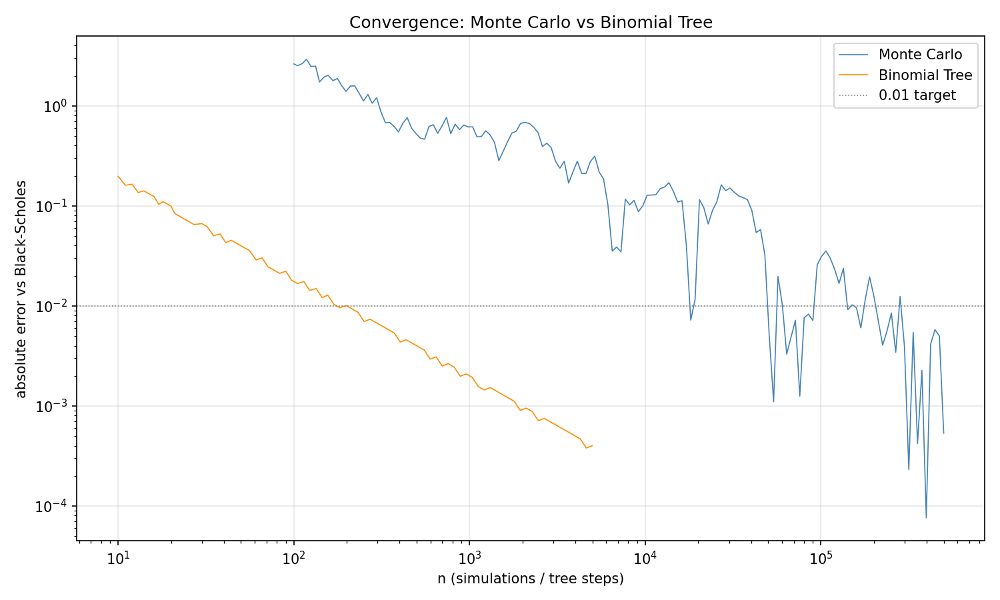
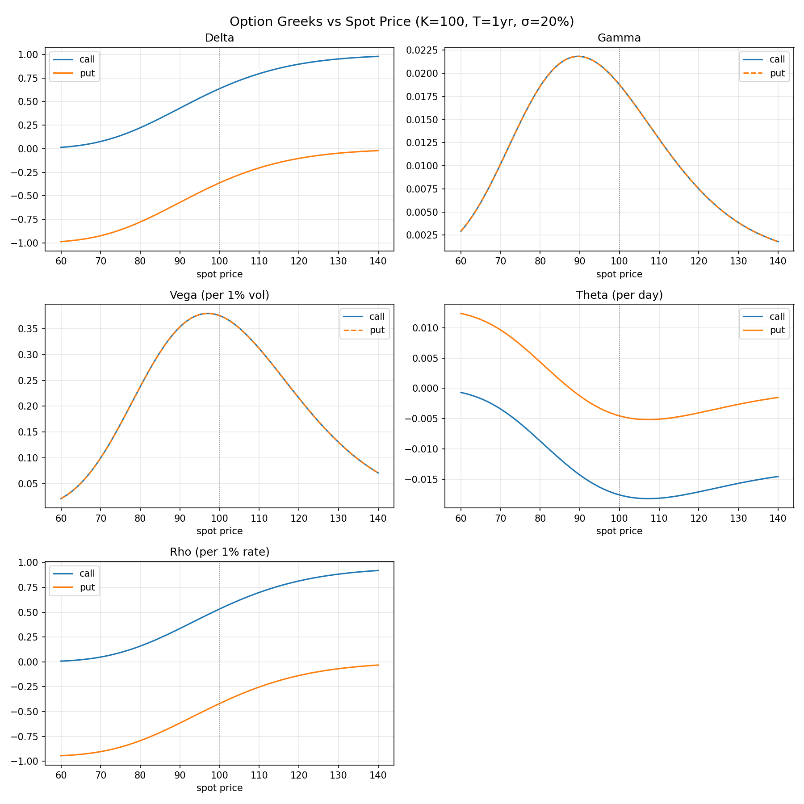

# Black-Scholes Option Pricer

An interactive option pricing dashboard built in Python. Implements three pricing
models from scratch and compares them side-by-side.

## Features

- **Black-Scholes** closed-form pricing for European calls and puts
- **Binomial Tree** pricing with configurable number of steps
- **Monte Carlo** simulation with configurable number of paths
- **Greeks** computation via numerical differentiation (Delta, Gamma, Vega, Theta, Rho)
- Interactive Streamlit dashboard with live-updating sliders
- Convergence plots showing how each model approaches the exact price
- Payoff diagrams with breakeven points
- Greek curves vs spot price

## Screenshots





## How to Run

```bash
pip install -r requirements.txt
streamlit run app.py
```

## How It Works

### Black-Scholes

The closed-form solution for European option pricing. Uses the standard normal CDF
via Python's `math.erf` — no external dependencies needed. Verified against known
textbook values and put-call parity.

### Binomial Tree

Discretizes the stock price into an N-step up/down lattice. At expiry, computes
payoffs at all terminal nodes, then works backwards to today by discounting at each
step. Converges to Black-Scholes as N increases (error ~ 1/N). Implemented with
NumPy array operations instead of nested loops.

### Monte Carlo

Simulates random stock price paths under geometric Brownian motion. Generates
terminal prices using the risk-neutral drift, computes payoffs, and averages.
Converges as 1/√n — slower than the binomial tree but can handle exotic payoffs.

### Greeks

All five Greeks computed numerically using central finite differences:

- **Delta** — sensitivity to stock price
- **Gamma** — sensitivity of delta to stock price
- **Vega** — sensitivity to volatility
- **Theta** — sensitivity to time (daily decay)
- **Rho** — sensitivity to interest rate

## Requirements

- Python 3.8+
- NumPy
- Matplotlib
- Streamlit
